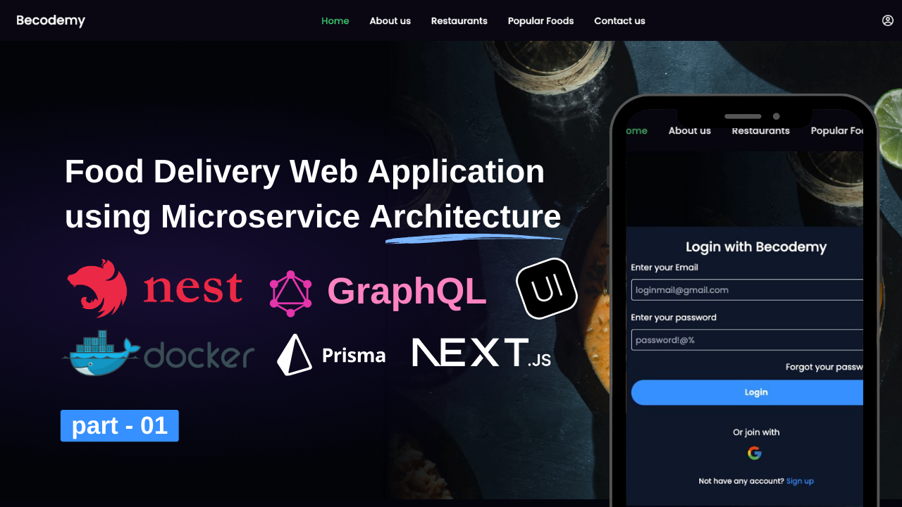

# Food Delivery Web Application using Microservice Architecture with Nest.js, GraphQL, Next.js, Prisma

Welcome to the open-source Food Delivery Web Application series utilizing Microservice Architecture. This project aims to create a comprehensive Food Delivery Web Application employing Microservice Architecture. Separate applications will be built for Admin, User, Restaurant Owner, and Delivery Man. The entire project will be freely accessible, and this README covers the initial part, with more to come.

## Open for Contributors

This project is open for contributions. Whether you want to modify aspects or collaborate on the entire project, you're welcome to join us. Given the scope of this significant project, your assistance can help bring it to completion quickly. Previous experience is not a barrier; if you possess frontend development skills, you can contribute.

## Technology Used

Given the Microservice Architecture, it's challenging to enumerate all the exact technologies we plan to use. However, for an overview, we intend to employ Nest.js as the backend framework, GraphQL for Microservice connection gateway, Docker for containerizing our application, Prisma as the Database ORM, and AWS ECS for deployment, along with other AWS platforms. On the frontend, Next.js will be used for speed optimization and superior SEO. As this is the first part of our project, not all technologies have been finalized.

## Support Our Work

You can support our efforts based on your eligibility. Your support is appreciated and encourages us to create more free projects. If you wish to contribute, you can donate starting from $1. [Click here to donate](https://www.becodemy.com/support/Food-Delivery-Web-Application-using-Microservice-Architecture-with-Nestjs-GraphQL-Nextjs-Prisma)
